# proyecto MongoDB
### 1. Debes seleccionar un fichero json que incluya todos los tipos de datos soportados en MongoDB
El fichero .json es [prankkids.json](prankkids.json). se trata de una consulta a la api [https://db.ygoprodeck.com/api-guide/](https://db.ygoprodeck.com/api-guide/) solicitando todas las cartas que pertenecen al arquetipo [Brominiños](https://yugioh.fandom.com/es/wiki/Bromini%C3%B1os)
### 2. Con la utilidad mongoimport introduce los documentos correspondientes a esa colección.
Para ello, se debe ejecutar el siguiente comando en la terminal:
```
mongoimport --db=yugioh --collection=prankkids --jsonArray --type json --file=prankkids.json
```
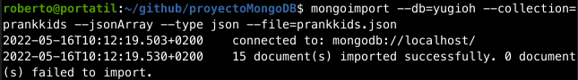
### 3. Insertar varios documentos utilizando los dos métodos de inserción de MongoDB
Los métodos son `insertOne` y `insertMany`. Se utilizan de la siguiente manera:
```
db.prankkids.insertOne(
   {
      "archetype" : "Prank-Kids",
      "atk" : 150,
      "attribute" : "FIRE",
      "desc" : "Carta de pruebas.",
      "id" : 1,
      "linkval" : 2,
      "name" : "carta 1",
      "race" : "Pyro",
      "type" : "Link Monster"
   }
)
```
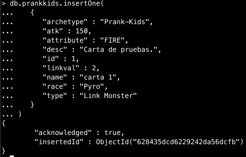
```
db.inventory.insertMany([
    {
        "archetype" : "Prank-Kids",
        "atk" : 3000,
        "attribute" : "WATER",
        "desc" : "Carta de pruebas 2.",
        "id" : 1,
        "linkval" : 2,
        "name" : "carta 2",
        "race" : "Pyro",
        "type" : "Link Monster"
     },
     {
        "archetype" : "Prank-Kids",
        "atk" : 150,
        "attribute" : "AIR",
        "desc" : "Carta de pruebas 3.",
        "id" : 1,
        "linkval" : 3,
        "name" : "carta 3",
        "race" : "Pyro",
        "type" : "Link Monster"
     }
 ])
```
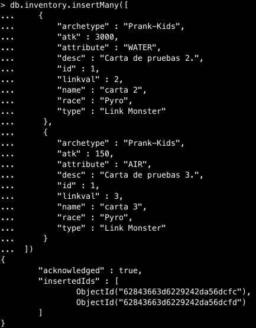
### 4. Elimina varios documentos utilizando los dos métodos de eliminación de MongoDB
Los métodos son `deleteOne` y `deleteMany`. Se utilizan de la siguiente manera:
```
db.prankkids.deleteOne({ attribute : "WATER" })
```
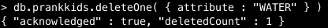
```
db.prankkids.deleteMany({ attribute : "WATER" })
```
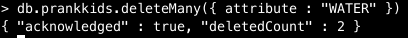
Donde deleteOne borra la primera coincidencia, y deleteMany borra todas las coincidencias.
### 5. Actualiza varios documentos utilizando los tres métodos de actualización de MongoDB
Los métodos son `updateOne`, `updateMany` y `replaceOne`. Se utilizan de la siguiente manera:
```
db.prankkids.updateOne(
   { "attribute" : "FIRE" },
   { $set : { "atk" : 2000 } }
)
```
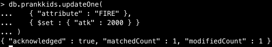
```
db.prankkids.updateMany(
   { attribute : "FIRE" },
   { $set : { atk : 2000 } }
)
```
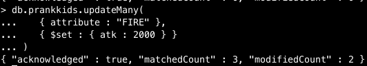
```
db.prankkids.replaceOne(
   { "name": "Prank-Kids Rocket Ride"},
   { "name": "carta reemplazada"}
)
```
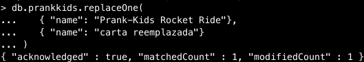

### 6. Consultas
**5 consultas de datos simples**
* Consulta los documentos cuyo valor "name" es igual a "Prank-Kids Battle Butler"
```
db.prankkids.find({ "name" : "Prank-Kids Battle Butler" })
```
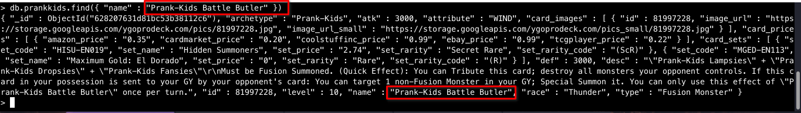
* Consulta los documentos cuyo atributo sea "WIND"
```
db.prankkids.find({ "attribute" : "WIND" })
```
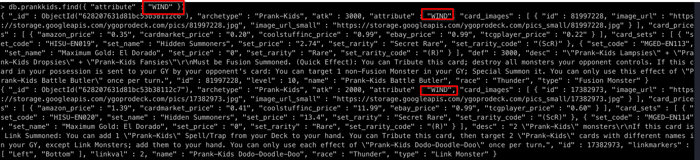
* Consulta los documentos cuyo valor "linkval" sea mayor que menor o igual a 2
```
db.prankkids.find({ "linkval" : { $lte : 2 } })
``` 
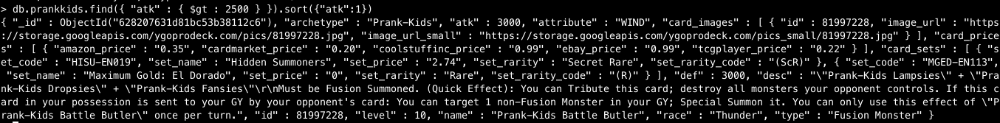
* Consulta Los documentos cuyo tipo empiece por "Lin"
```
db.prankkids.find({ "type" : {$regex: /^Lin/ } })
```
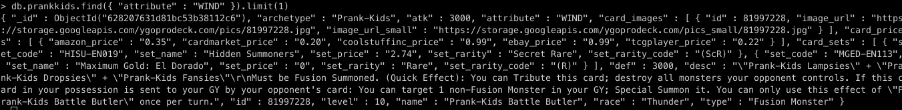
* Consulta los documentos cuyo ataque sea superior a 2000
```
db.prankkids.find({ "atk" : { $gt : 2000 } })
```
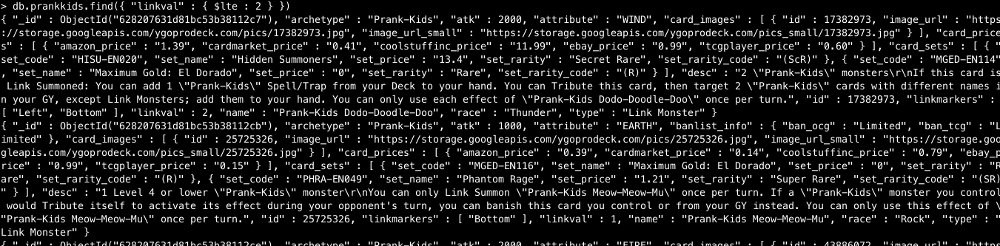
**3 consultas con arrays**
* Consulta los documentos que contengan en el array linkmarkers el valor "Bottom" como uno de sus elementos
```
db.prankkids.find( { "linkmarkers": "Bottom" } )
```
* Consulta los documentos que contengan en el array linkmarkers los valores "Right" y "Bottom" en cualquier orden
```
db.prankkids.find( { "linkmarkers": { $all: ["Right", "Bottom"] } } )
```
* Consulta los documentos cuyo array linkmarkers tenga exactamente 1 elemento
```
db.prankkids.find( { "linkmarkers": { $size: 1 } } )
```
**3 consultas con documentos embebidos**
**Consulta de agrupación**
